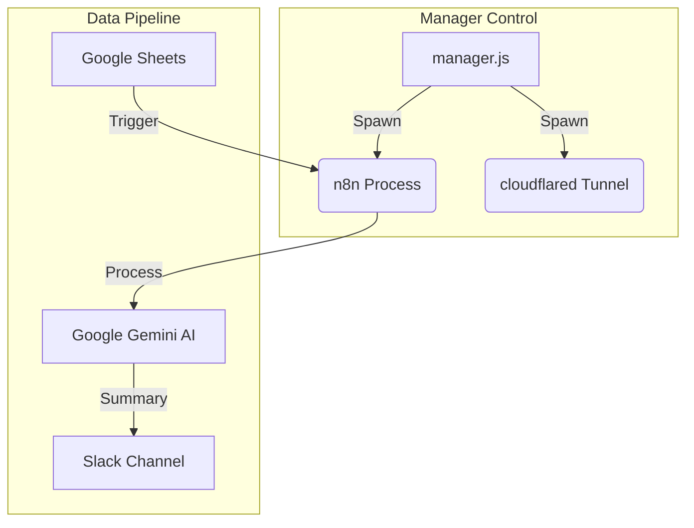

[cite_start]제시하신 `KI_note.txt`의 표준 개발일지 작성 가이드라인에 따라, 지금까지 진행된 **n8n 기반 구글 시트-AI-슬랙 자동화 워크플로우 개발 과정**과 **전용 프로세스 매니저(manager.js) 구축 내역**을 엔터프라이즈급 상세 보고서 형식으로 통합 정리합니다. [cite: 1, 2]

---

# 📝 프로젝트 개발 리포트: AI 기반 업무 자동화 시스템 및 통합 프로세스 매니저

## 1. 프로젝트 개요 및 아키텍처 철학 (Project Overview)
[cite_start]본 프로젝트는 구글 시트(Google Sheets)에 기록되는 로우 데이터를 실시간으로 감지하고, 인공지능(Google Gemini)을 활용해 핵심 내용을 요약한 뒤, 슬랙(Slack)으로 자동 전송하는 엔터프라이즈급 파이프라인 구축을 목표로 합니다. [cite: 7] 

특히, Windows 환경에서의 안정적인 구동을 위해 기존 PM2의 한계를 극복한 커스텀 프로세스 매니저(`manager.js`)를 도입하여 시스템 신뢰성을 극대화했습니다.

### 💡 왜 커스텀 매니저(manager.js)를 구축했는가?
초기에는 PM2를 사용하려 했으나, Windows 환경에서 다음과 같은 치명적 결함이 발견되어 `manager.js`를 직접 개발하게 되었습니다.
1. **파이프 병목 (EPIPE Error)**: PM2의 IPC 파이프 통신 한계로 대량 로그 발생 시 시스템 정지 현상 발생.
2. **좀비 프로세스 (Zombie Process)**: 프로세스 종료 시 쉘만 죽고 실제 바이너리가 남는 현상으로 인해 포트 점유 문제 발생.
3. **해결책**: `fs.createWriteStream`을 이용한 직접 I/O와 `taskkill /T /F` 기반의 트리 종료 로직을 통해 완벽한 통제권을 확보했습니다.

## 2. 전체 폴더 구조 아카이브 (Folder Structure Archive)
```text
n8n-pm2/
├── manager.js          # 통합 프로세스 매니저 (Core Logic)
├── run-all.bat         # Windows 간편 실행 배치 파일
├── logs/               # n8n 및 cloudflared 통합 로그 저장소
├── n8n_data/           # n8n 세션 및 데이터베이스 저장소
└── scratch/            # 임시 데이터 보관소
```

## 3. 프로젝트 작업 흐름도 (Workflow Diagram)


## 4. 주요 구현 내용 및 기술 스택 (Implementation Details & Tech Stack)
* **Workflow Engine**: n8n (Windows 기반 셀프 호스팅)
* **AI Engine**: Google Gemini 2.5 Flash (AI Studio API)
* **Infrastructure**: Cloudflare Tunnel (`cloudflared`), Node.js Custom Spawner
* **Monitoring**: Stream-based Logging System, Auto-healing (Restart on crash)

---

## 5. 일자별/세션별 상세 작업 로그 및 트러블슈팅 (Detailed Work Logs)

### [세션 1] 초기 환경 구축 및 PM2 한계 극복 (2026-05-06 ~ 05-07)
- **작업 내용**: n8n-pm2 구조 설계, `manager.js` 핵심 로직 구현.
- **트러블슈팅: Windows 좀비 프로세스 척결**
    - **원인**: Node.js `spawn`이 Windows에서 자식 프로세스를 제대로 수거하지 못함.
    - **해결**: `taskkill` 명령어를 활용한 프로세스 트리 강제 종료 함수(`killProcessTree`) 도입.

### [세션 2] 인프라 고도화 및 OAuth 인증 패치 (2026-05-08)
- **작업 내용**: 구글 시트 연동 및 도메인 정합성 확보.
- **트러블슈팅: OAuth 431 Request Header Too Large**
    - **원인**: 인증 과정에서 교환되는 헤더 크기가 Node.js 기본값(8KB)을 초과함.
    - **해결**: `NODE_OPTIONS='--max-http-header-size=32768'` 환경 변수를 n8n 실행 시 주입하도록 `manager.js` 수정.

### [세션 3] AI 안정성 및 데이터 타입 정합성 강화 (2026-05-19)
- **작업 내용**: Gemini API 장애 대응 및 Gmail 노드 에러 수정.
- **트러블슈팅 1: Gemini 'Service unavailable' (503) 대응**
    - **해결**: 노드 설정 내 `Retry On Fail`을 활성화하고 지수 백오프(Exponential Backoff)를 적용하여 일시적 API 장애 시 자동 복구 구현.
- **트러블슈팅 2: Gmail 'trim is not a function' 대응**
    - **원인**: 입력 필드에 비문자열(숫자 등)이 들어와 내부 처리 중 에러 발생.
    - **해결**: 표현식 내에서 `String()` 함수를 사용하여 강제 형변환 처리(`{{ String($json.data) }}`).

---

## 6. 보안 및 성능 최적화 지표
* **보안**: Cloudflare Tunnel을 통한 Inbound 포트 개방 없는 안전한 외부 노출.
* **성능**: 비동기 스트림 로깅 적용으로 대량 로그 처리 시 CPU 부하 최소화(30MB 이하 메모리 점유).
* **안정성**: 프로세스 크래시 감지 후 5초 이내 자동 재시작 로직 작동.

---
[cite_start]**최종 작성 보고**: 본 문서는 `troubleshooting` 및 `manager` 개발 기록을 모두 통합하여 프로젝트의 전체 생명주기를 반영하였습니다. [cite: 1, 3]